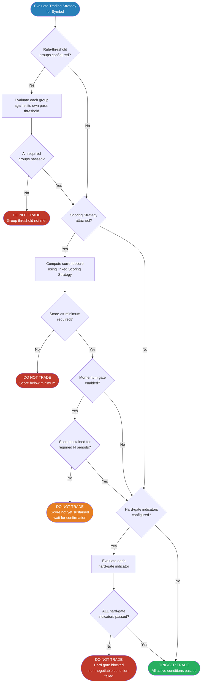
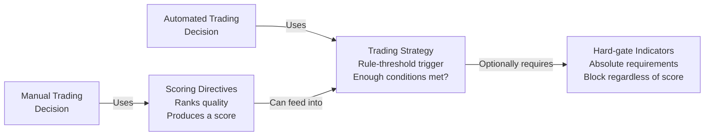
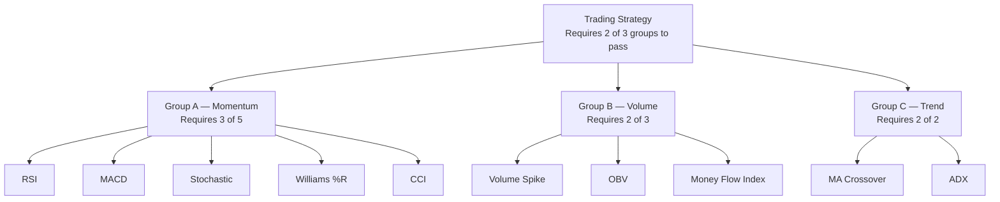
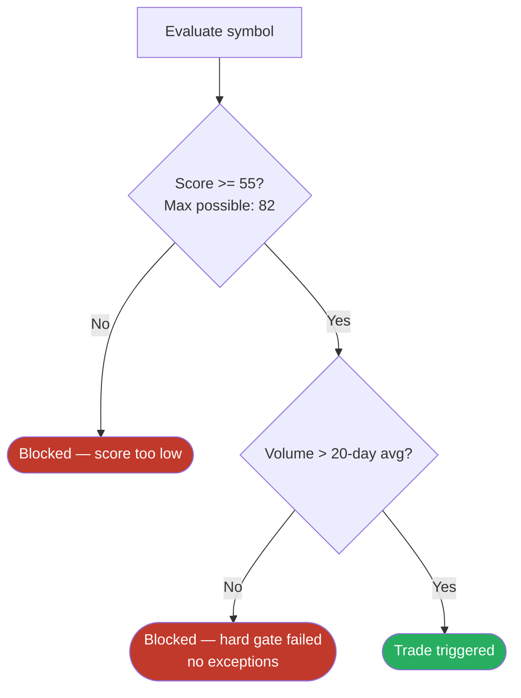

# Trading Strategy Decision Flow — Diagram Source

## Purpose

This file contains Mermaid diagram source for the Trading Strategy decision flow. It is the source of truth for the Diagrams tab until video walkthroughs are produced.

---

## Full Decision Flow

---

## Simplified overview (for intro training)

---

## Group structure diagram (for grouped indicators training)

---

## Score + hard gate combination (for Level 3 training)

---

## Usage note

These diagrams are intended to be rendered in the admin Diagrams tab using the existing Mermaid render pipeline. When interactive training is implemented (pointer-guided walkthroughs), these diagrams will become reference visuals that the pointer system links back to at each step.
